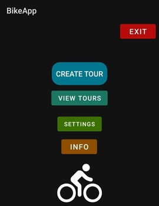
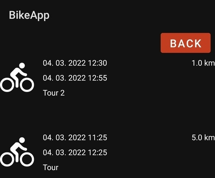
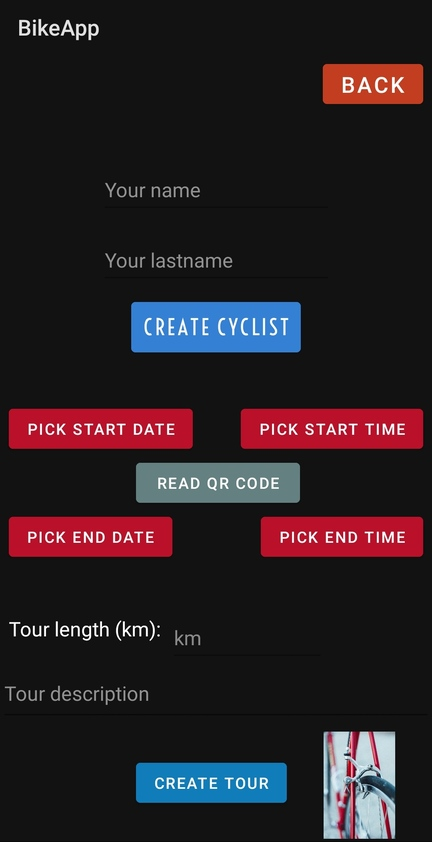

# BikeApp

  
  

Cycling app to store tours. Supported options:
  <ul>
    <li>Cyclist creation</li>
    <li>Adding tours and relevant information about them, e. g. tour length, description ...</li>
    <li>Adding tour via QR code</li>
    <li>Tour view, update and deletion</li>
  </ul>
  
Supported languages:
  <ul>
    <li>English</li>
    <li>Slovene</li>
    <li>German</li>
  </ul>
 

# Images

  
  
  

